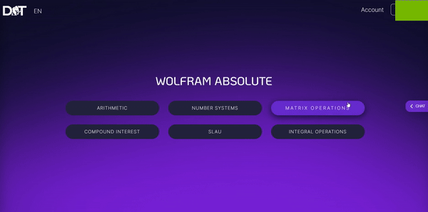
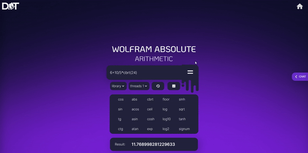
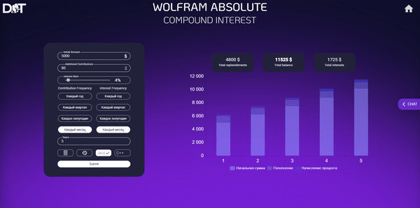
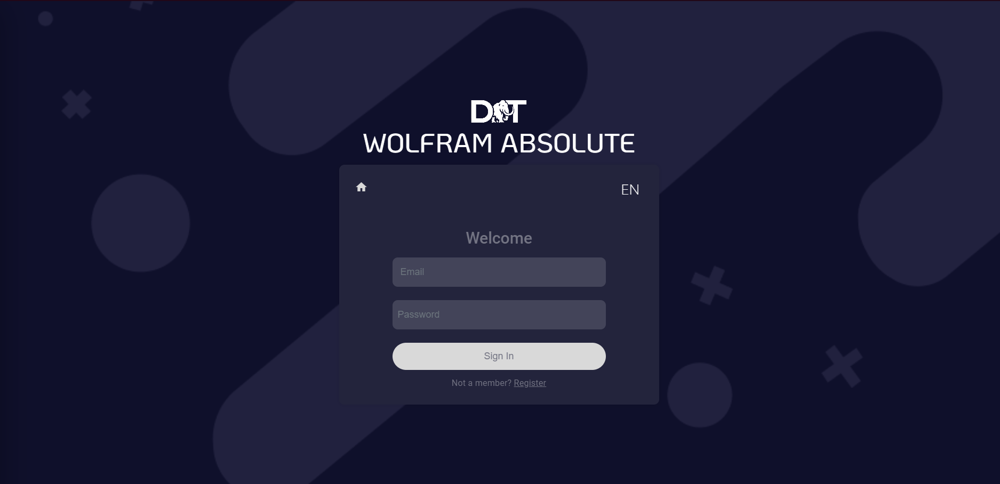
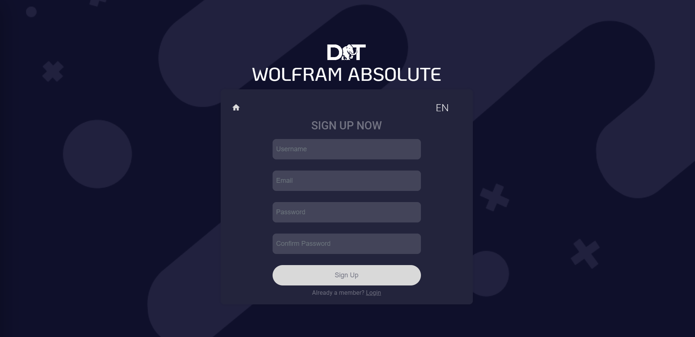
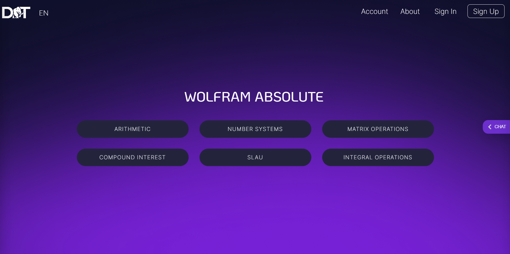
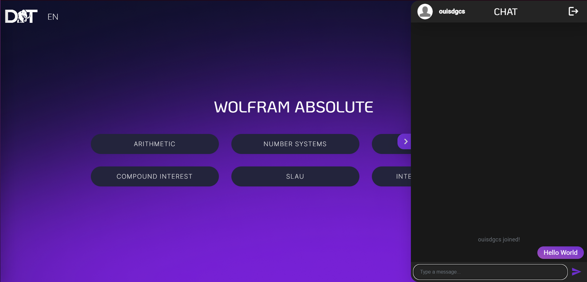
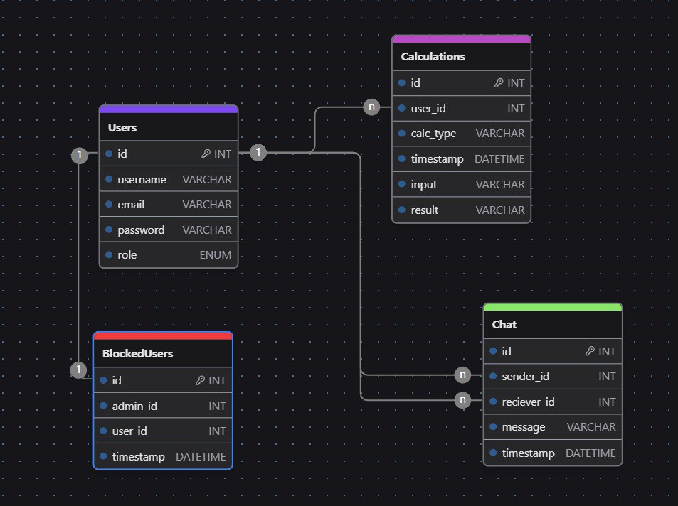

# Wolfram-Absolute

# educational project for university

**Название проекта:** Wolfram Absolute

**Описание:** Wolfram Absolute - это комплексная система вычислений, включающая в себя как серверную, так и клиентскую части. Бэкенд проекта написан на Java и оснащен функциями авторизации, вычислений, истории операций и чата, что обеспечивает надежную и масштабируемую работу. Фронтенд реализован на Angular, предоставляя пользователям интуитивно понятный и удобный интерфейс для взаимодействия с системой.

## Стек технологий

- **Язык программирования:** Java
- **Веб-фреймворк:** Spring Boot
- **База данных:** MySQL
- **Документирование API:** Swagger
- **Контейнеризация:** Docker
- **Фронтенд-фреймворк:** Angular

## Инструкция по развертыванию и настройке проекта для локального запуска

### Настройка окружения

Убедитесь, что у Вас установлен JDK версии не ниже 17, MySQL Server, а также Node.js с npm.

### Развертывание Backend части

```bash
git https://github.com/Kowa1ak/Wolfram-Absolute.git
cd Wolfram-Absolute/back-end
mvn clean install
mvn spring-boot:run
```

### Развертывание Frontend части

```bash
git https://github.com/Kowa1ak/Wolfram-Absolute.git
cd Wolfram-Absolute/front-end
npm install
ng serve
```

## Инструкция по развертыванию и настройке проекта в Docker

### Клонируйте репозиторий проекта на локальный компьютер:

```bash
git https://github.com/Kowa1ak/Wolfram-Absolute.git
```

### Убедитесь, что на вашем компьютере установлен Docker

### Откройте терминал или командную строку и перейдите в корневую папку проекта, где находится файл docker-compose.yml

_Выполните команду_

```bash
cd Wolfram-Absolute/
docker-compose up --build
```

### После того, как все контейнеры будут запущены, вы сможете получить доступ к вашему приложению двумя способами

- **Откройте веб-браузер и перейдите по адресу `http://localhost:4200`**
- **Вы можете отправлять запросы к API, используя адрес `http://localhost:8080`**

## Документирование API - Swagger

Документация API доступна по адресу `http://localhost:8080/swagger-ui.html`

## Работа проекта

### Вычисления








### Экран логина



### Экран регистрации



### Главная страница



### Чат



## Прмиер логов

```bash
24-05-28 00:05:45 INFO  CalculationsController:199 - Compound interest calculation completed with 5 years of data.
2024-05-28 00:06:00 INFO  CalculationsController:155 - Received number system conversion request: NumSysConverterRequest(email=tester@g, number=46, library=Java, base1=10, base2=3)
2024-05-28 00:06:00 INFO  NumberSystemConverter:13 - Starting base conversion for number: 46 from base 10 to base 3
2024-05-28 00:06:00 INFO  NumberSystemConverter:16 - Conversion successful. Result: 1201
2024-05-28 00:06:00 INFO  CalculationsController:159 - Number system conversion result: 1201
2024-05-28 00:06:20 INFO  CalculationsController:102 - Received sys solving calculation request: SlauRequest(equations={34, 46 | 875}, {2, 34 | 45}, threads=2, library=Java, email=tester@g)
2024-05-28 00:06:20 INFO  CalculationsController:113 - calculation result: {Result=26.01503759398496 -0.20676691729323304, Time: 0.0010998 seconds}
```

## Схема базы данных


